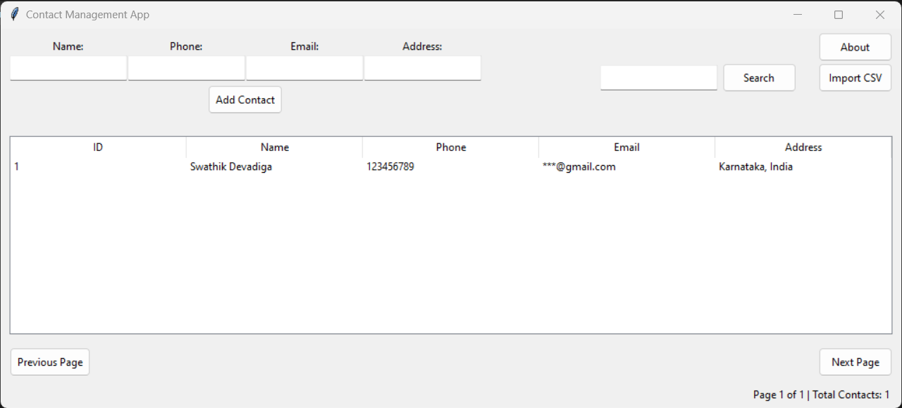

# Contact Management App

The Contact Management App is a Python-based graphical user interface (GUI) application that allows users to efficiently manage their contact information. This README provides an overview of the app, installation instructions, usage guidelines, and other relevant information.



## Table of Contents

- [Features](#features)
- [Installation](#installation)
- [Usage](#usage)
- [CRUD Operations](#crud-operations)
- [Search](#search)
- [Importing Contacts](#importing-contacts)
- [Pagination](#pagination)
- [Context Menu](#context-menu)
- [About Information](#about-information)
- [Dependencies](#dependencies)
- [License](#license)

## Features

- Create, read, update, and delete (CRUD) operations for managing contacts.
- Store contact information, including name, phone number, email, and address, in an SQLite database.
- Pagination support to handle a large number of contacts.
- Search functionality to find specific contacts quickly.
- Import contacts from CSV files.
- Context menu for editing and deleting contacts.
- About information to display app details.

## Installation

Follow these steps to install and run the Contact Management App:

1. Clone the repository to your local machine:
   ```bash
   git clone https://github.com/your-username/contact-management-app.git
   
2. Navigate to the project directory:
   ```bash
   cd contact-management-app
   
3. Install the required dependencies from the requirements.txt file:
   ```bash
   pip install -r requirements.txt
   
4. Run the application:
   ```bash
   python app.py

The app's GUI should appear, allowing you to start managing your contacts.

## Usage
## CRUD Operations
- Create: To add a new contact, enter the name, phone number, email, and address in the input fields and click the "Add Contact" button.
- Read: Contacts are displayed in a tabular format with columns for ID, name, phone number, email, and address.
- Update: To edit an existing contact, double-click on the contact in the list. A new window will open, allowing you to update the contact's information.
- Delete: To delete a contact, select it in the list and right-click to access the context menu, which includes the option to delete the contact.

## Search
Use the search box at the top right to search for contacts. Enter a query and click the "Search" button to filter and display matching contacts.
## Importing Contacts
Click the "Import CSV" button to select a CSV file containing contact information for import. The app will add the contacts from the CSV file to the database.
## Pagination
Use the "Previous Page" and "Next Page" buttons to navigate through pages of contacts, especially if you have a large number of contacts.
## Context Menu
Right-click on a contact in the list to access the context menu, which includes options to edit and delete contacts.
## About Information
Click the "About" button to view information about the app, including its creator, version, and the date of the last modification.

## Dependencies
### The following Python packages are required to run the Contact Management App:
- altgraph==0.17.3
- pefile==2023.2.7
- Pillow==10.0.1
- pyinstaller==5.13.2
- pyinstaller-hooks-contrib==2023.8
- pywin32-ctypes==0.2.2
- ttkthemes==3.2.2
### You can install these dependencies using the `pip` command (see the [Installation](#installation) section).

## License
This Contact Management App is open-source software licensed under the MIT License. Feel free to use, modify, and distribute it as needed.
